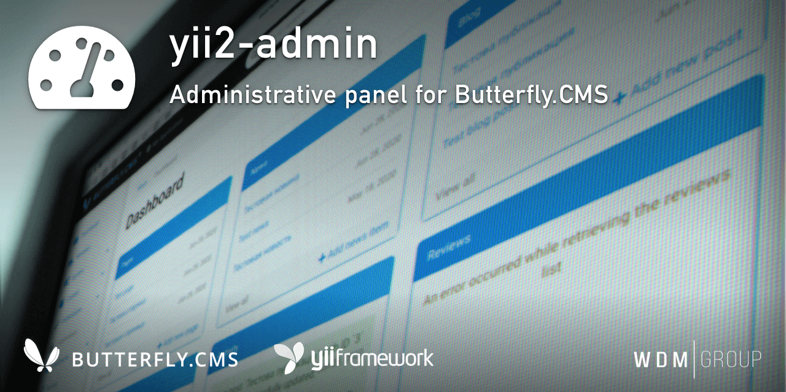

# Yii2 Admin Module
Administrative panel for [Butterfly.CMS](https://github.com/wdmg/butterfly.cms).
                                                                                                     
This module is an integral part of the [Butterfly.СMS](https://butterflycms.com/) content management system, but can also be used as an standalone extension.

Copyrights (c) 2019-2023 [W.D.M.Group, Ukraine](https://wdmg.com.ua/)

# Requirements 
* PHP 5.6 or higher
* Yii2 v.2.0.40 and newest
* [Yii2 Base](https://github.com/wdmg/yii2-base) module (required)
* [Yii2 Users](https://github.com/wdmg/yii2-users) module (required)

# Installation
To install the module, run the following command in the console:

`$ composer require "wdmg/yii2-admin"`

After configure db connection, run the following command in the console:

`$ php yii admin/init`

And select the operation you want to perform:
  1) Apply all modules migrations
  2) Revert all modules migrations

# Migrations
In any case, you can execute the migration and create the initial data, run the following command in the console:

`$ php yii migrate --migrationPath=@vendor/wdmg/yii2-admin/migrations`

# Configure

To add a module to the project, add the following data in your configuration file:

    'modules' => [
        ...
        'admin' => [
            'class' => 'wdmg\admin\Module',
            'routePrefix' => 'admin',
            'checkForUpdates' => true, // boolean, the flag if updates check turn on
            'cacheExpire' => 3600, // integer, the time to expire cache
            'multiSignIn' => false, // not allow by default
            'sessionTimeout' => 900, // 15 min.
            'customLocales' => [ // expanding the list of language locales for searching translations
                'uk-UA' => 'Українська',
            ],
            'customSupportModules' => [ // expanding the list of modules available for installation and download
                'wdmg/yii2-example',
            ],
            'customSidebarMenu' => [ // extending the sidebar menu list
                [
                    'label' => 'Example',
                    'icon' => 'fa fa-fw fa-bars',
                    'url' => ['/admin/example/default'],
                    'order' => 10,
                ]
            ],
            'customCreateMenu' => [ // expanding the creation menu list
                'wdmg/yii2-example' => [
                    'label' => 'Add new example',
                    'url' => ['/admin/example/default/create']
                ]
            ],
            'useSphinxSearch' => true, // boolean, the flag for configuration Sphinx Search
            'sphinxSearchConf' => [ // configuration of Sphinx Search daemon
                'dsn' => "mysql",
                'host' => "127.0.0.1",
                'port' => "9306",
                'username' => "",
                'password' => "",
            ]
        ],
        ...
    ],

# Routing

| Link to route (without prettyurl)                     | Link to route (prettyurl enabled)     | Description                          |
|:----------------------------------------------------- |:------------------------------------- |:------------------------------------ |
| http://example.com/index.php?r=admin                  | http://example.com/admin              | Main dashboard                       |
| http://example.com/index.php?r=admin/admin/login      | http://example.com/admin/login        | Auth to dashboard                    |
| http://example.com/index.php?r=admin/admin/restore    | http://example.com/admin/restore      | Restore access password              |

Use the `Module::dashboardNavItems()` method of the module to generate a navigation items list for NavBar, like this:

    <?php
        echo Nav::widget([
        'options' => ['class' => 'navbar-nav navbar-right'],
            'label' => 'Modules',
            'items' => [
                Yii::$app->getModule('admin')->dashboardNavItems(),
                ...
            ]
        ]);
    ?>

# Status and version [ready to use]
* v.1.4.4 - Add task and tickets counters
* v.1.4.3 - Add server date and time to dashboard UI
* v.1.4.2 - Fix add to favourites